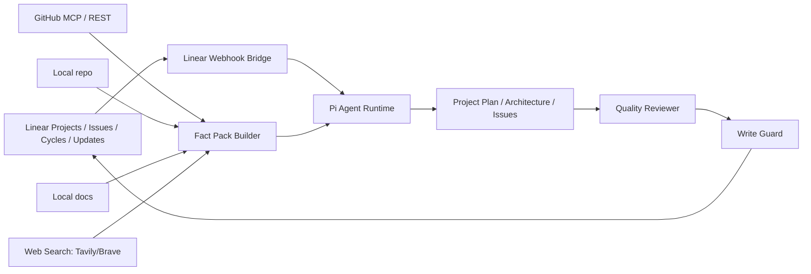

# Linear Pi Project Admin Agent

这是一个面向 **Pi Coding Agent + Linear** 的专用部署项目骨架，用于搭建“Linear 项目管理员 Agent”。它把你的原始 `.agents.zip` 保留下来，并新增了事实来源层、GitHub MCP/API 支持、本地 repo/docs 支持、联网搜索支持、Linear webhook bridge、workspace manifest 同步、写入治理和项目质量审查。

## 核心设计



## 新增能力

- **GitHub 事实依据**：优先使用 GitHub MCP Server；不可用时使用 GitHub REST fallback。
- **本地 repo 事实依据**：读取 branch、commit、dirty status、README、package、docs。
- **本地文档事实依据**：搜索 PRD、ADR、research notes、design docs。
- **联网搜索能力**：Tavily 或 Brave Search，用于官方文档、依赖库、标准、近期变化。
- **Fact Pack**：所有复杂项目规划前先建立事实包。
- **Plan Reviewer**：对项目计划做确定性质量检查。
- **Workspace Sync**：同步 Linear labels、members、workflow states、teams。
- **Write Guard**：Linear 写入默认 dry-run，确认后执行。
- **Linear-native 唤醒**：通过 Linear webhook、Agent Session、`Agent:*` labels 触发。

## 目录结构

```text
AGENTS.md                         # 专用总指令
SYSTEM.md                         # Pi system override
.pi/settings.json                 # Pi 项目级加载配置
.pi/extensions/                   # Pi 专用 tools / guard / fact sources
.pi/prompts/                      # slash prompt templates
.agents/skills/                   # 原始 + 新增 skills
config/                           # manifest / policies / repo map / MCP config
services/linear-bridge/           # Linear webhook → Pi queue/runner
scripts/                          # evidence collection / validation / smoke tests
schemas/                          # Fact Pack 与 Project Plan schema
state/                            # runtime state; gitignored
```

## 快速开始

```bash
cp .env.example .env
npm install
npm run validate
npm run linear:smoke
npm run fact:pack -- --task "审查当前项目规划"
```

然后在该目录运行 Pi：

```bash
pi
```

或者启动 Linear bridge：

```bash
npm run bridge:dev
```

详见 `docs/DEPLOYMENT.md`。

## 重要限制

- `scripts/linear-cli.mjs apply` 目前是安全 scaffold：默认只 dry-run，不会真实写入 Linear。上线前需要按你的 Linear schema 和写入策略补齐 mutation。
- GitHub MCP 的配置文件已提供；Pi 是否能直接作为 MCP host 取决于你的 Pi/MCP 插件安装情况。本项目同时提供 GitHub REST fallback。
- Web search 需要 `TAVILY_API_KEY` 或 `BRAVE_SEARCH_API_KEY`。
- 不要把 `.env`、token、secret 写入 Linear 或提交到 GitHub。
