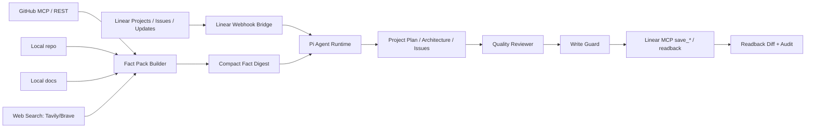

# Linear Pi Project Admin Agent

这是一个面向 **Pi Coding Agent + Linear** 的专用部署项目骨架，用于搭建“Linear 项目管理员 Agent”。它把你的原始 `.agents.zip` 保留下来，并新增了事实来源层、GitHub MCP/API 支持、本地 repo/docs 支持、联网搜索支持、Linear webhook bridge、workspace manifest 同步、写入治理和项目质量审查。

## 核心设计


```mermaid
flowchart LR
  Linear[Linear Projects / Issues / Updates] --> Bridge[Linear Webhook Bridge]
  GitHub[GitHub MCP / REST] --> Fact[Fact Pack Builder]
  LocalRepo[Local repo] --> Fact
  LocalDocs[Local docs] --> Fact
  Web[Web Search: Tavily/Brave] --> Fact
  Bridge --> Pi[Pi Agent Runtime]
  Fact --> Digest[Compact Fact Digest]
  Digest --> Pi
  Pi --> Plan[Project Plan / Architecture / Issues]
  Plan --> Review[Quality Reviewer]
  Review --> Guard[Write Guard]
  Guard --> MCP[Linear MCP save_* / readback]
  MCP --> Diff[Readback Diff + Audit]
```

## 新增能力

- **GitHub 事实依据**：优先使用 GitHub MCP Server；不可用时使用 GitHub REST fallback。
- **本地 repo 事实依据**：读取 branch、commit、dirty status、README、package、docs。
- **本地文档事实依据**：搜索 PRD、ADR、research notes、design docs。
- **联网搜索能力**：Tavily 或 Brave Search，用于官方文档、依赖库、标准、近期变化。
- **Fact Pack**：所有复杂项目规划前先建立事实包；上下文只加载摘要，原始证据落盘。
- **Plan Reviewer**：对项目计划做确定性质量检查。
- **Workspace Sync**：同步 Linear labels、members、workflow states、teams。
- **Write Guard**：Linear 写入默认 dry-run；`config/write-policy.yaml` v2 solo 模式下，mutation 经一次 `plan_confirmation` 后执行，并强制 readback diff 与 audit（L4/L5 仍硬 deny）。
- **Linear-native 唤醒**：通过 Linear webhook、Agent Session、`Agent:*` labels 触发。

## 目录结构

```text
SYSTEM.md                         # Pi system override
.pi/settings.json                 # Pi 项目级加载配置
.pi/extensions/                   # Pi 专用 tools / guard / fact sources
.pi/prompts/                      # 唯一可见 slash 命令入口；只做路由和输入绑定
.agents/skills/                   # 行为协议来源；不直接暴露为 Pi slash 命令
config/                           # manifest / policies / repo map / MCP config
services/linear-bridge/           # Linear webhook → Pi queue/runner
scripts/                          # evidence collection / validation / smoke tests
schemas/                          # Fact Pack 与 Project Plan schema
state/                            # runtime state; gitignored
```

## 快速开始

```bash
cp .env.example .env
npm install
npm run validate
npm run linear:smoke
npm run fact:pack -- --task "审查当前项目规划"
```

然后在该目录运行 Pi：

```bash
pi
```

或者启动 Linear bridge：

```bash
npm run bridge:dev
```

详见 `docs/DEPLOYMENT.md`。

## 重要限制

- `config/write-policy.yaml`（v2 solo）已将企业级 L0–L5 写入层级收缩为 solo 单人流程：一次 `pi_ask_user(flow=plan_confirmation)` → Linear MCP 写入 → readback diff → audit；L4/L5 删除/归档/密钥字段仍默认 deny。真实写入还须同时满足 `LINEAR_WRITE_MODE=confirmed-only`、`ALLOW_LINEAR_WRITES=true`、write plan `dryRun=false`、`confirmedByUser=true` 和 CLI `--confirmed`。
- Pi 中的 slash 命令只保留 `.pi/prompts/` 这一套可见接口；`.agents/skills/` 仍加载为行为协议来源，但 `enableSkillCommands=false`，避免 prompt 与 skill 同名命令重复。
- v0.1 范围以 `docs/SCOPE_FREEZE.md` 为准：只覆盖本地安装、事实层、Pi 交互、Webhook Bridge、Project Plan reviewer、写入治理和运维文档。
- GitHub MCP 的配置文件已提供；Pi 是否能直接作为 MCP host 取决于你的 Pi/MCP 插件安装情况。本项目同时提供 GitHub REST fallback。
- Web search 需要 `TAVILY_API_KEY` 或 `BRAVE_SEARCH_API_KEY`。
- 不要把 `.env`、token、secret 写入 Linear 或提交到 GitHub。

## 验收命令

```bash
npm run validate
npm test
npm run test:plan-review
npm run test:repo-map
npm run test:repo-map-drift
npm run test:pi-ask-user
npm run test:wezterm-launch
npm run test:linear-apply-mode
npm run plan:review -- examples/project-plan.sample.json --strict
npm run plan:review -- examples/write-plan.sample.json --strict
npm run linear:smoke
npm run linear:workspace
npm run fact:pack -- --task "smoke test"
npm run test:webhook-signature
```

## Model Trust Boundary

`.pi/settings.json` must list explicit reviewed model IDs in `enabledModels`. Wildcard entries such as `gpt-*`, `claude-*`, or `gemini-*` are not allowed for the Linear write agent because user-level settings overrides or future external provider registration could expand the runtime trust boundary without code review.

User-level Pi settings may narrow local availability, but must not add models or providers for this repo's Linear write runtime. Any model/provider expansion requires a tracked PR that updates `.pi/settings.json`, `scripts/config-security-gate.mjs`, docs, and the lockfile-backed validation evidence.

`npm run validate` includes the configuration security gate. `npm test` is the merge-gate umbrella for the focused safety checks used by this repo.
